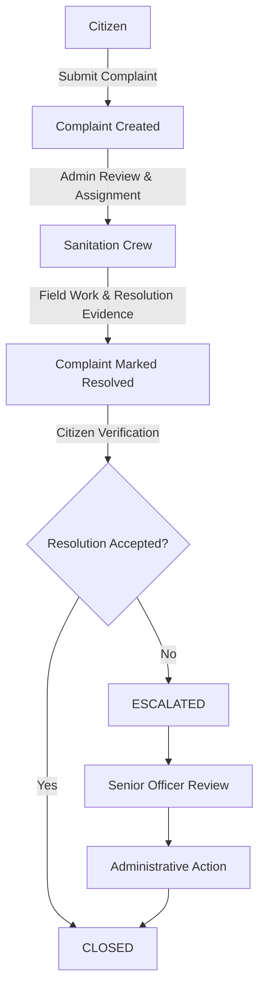

# 🌿 Resolve & Verify

### A Citizen-Centric Complaint Management System for Islamabad

<p align="center">
  <strong>A Smart Citizen-Centric Framework for Complaint Management, Resolution Verification, and Municipal Accountability</strong>
</p>

<p align="center">
  
  
  
  
  
</p>

<p align="center">
  <a href="#overview">Overview</a> •
  <a href="#system-workflow">Workflow</a> •
  <a href="#technology-stack">Technology Stack</a> •
  <a href="#installation">Installation</a> •
  <a href="#api-overview">API</a> •
  <a href="#deployment">Deployment</a>
</p>

---

## 📖 Overview

**Resolve & Verify** is a full‑stack, citizen‑centric complaint management platform designed around municipal sanitation services in Islamabad.

The system is designed to close an important accountability gap in conventional complaint handling: a service provider may mark a complaint as resolved, while the citizen may still consider the issue unresolved.

**Resolve & Verify introduces a citizen verification stage after field resolution.** The citizen can either:

- ✅ **Accept** the resolution – closes the complaint
- ❌ **Reject** the resolution – escalates to an authorized officer for review and administrative action

The platform combines:

- A **React**‑based web application for administrative and officer workflows
- A **Flutter** mobile application for citizens and sanitation crews
- A **Node.js / Express** REST API for backend services
- **MongoDB Atlas** for persistent data storage
- **Firebase Cloud Messaging (FCM)** for push notifications
- **Email OTP** authentication and **JWT**‑based authorization

---

## 🎯 Objectives

The primary objectives of the system are to:

- Digitize the municipal sanitation complaint process
- Allow citizens to submit and monitor complaints
- Provide administrators with centralized complaint management
- Assign complaints to responsible sanitation crews
- Allow field crews to submit resolution information and evidence
- Give citizens the ability to verify completed work
- Escalate rejected resolutions for officer review
- Maintain a traceable digital record of complaint activity
- Improve transparency and accountability in municipal service delivery

---

## 🔄 System Workflow

The complete complaint lifecycle is designed as a closed‑loop process. You can view the workflow using the Mermaid diagram below:



---

## 👥 User Roles

| Role | Primary Responsibilities |
|------|--------------------------|
| **Citizen** | Submit complaints, view personal complaints, track status, verify resolutions |
| **Sanitation Crew** | View assigned complaints, perform field work, submit resolution evidence |
| **Administrator** | Monitor complaints, assign complaints, manage sanitation crews |
| **Senior Officer** | Review escalated complaints, compare evidence, record administrative penalties |

---

## 🔑 Key Features

### Citizen Module

| Feature | Description |
|---------|-------------|
| Authentication | Email OTP‑based login |
| Complaint Submission | Description, address, GPS location, before‑evidence |
| Complaint History | Personal complaint list with status tracking |
| Resolution Verification | Accept or reject completed work |
| Notifications | Real‑time updates and alerts |

### Sanitation Crew Module

| Feature | Description |
|---------|-------------|
| Authentication | Secure login |
| Dashboard | View assigned complaints |
| Complaint Details | Location, description, and evidence |
| Resolution Workflow | Submit evidence and mark resolved |
| Status Updates | Real‑time status management |

### Administrator Module

| Feature | Description |
|---------|-------------|
| Dashboard | Centralized complaint monitoring |
| Filtering | Sort and filter complaints by status |
| Crew Management | Add, view, and manage sanitation crews |
| Assignment | Assign complaints to responsible crews |

### Senior Officer Module

| Feature | Description |
|---------|-------------|
| Escalation Management | View all escalated complaints |
| Investigation | Review complaint details and evidence |
| Evidence Comparison | Before‑and‑after photo review |
| Administrative Action | Record penalties and finalize cases |

---

## 🏗️ Technology Stack

### Frontend

| Technology | Purpose |
|------------|---------|
| React.js | Web application development |
| React Router | Client‑side routing |
| Context API | Application state management |
| CSS3 | User interface styling |

### Mobile

| Technology | Purpose |
|------------|---------|
| Flutter | Cross‑platform mobile application |
| Dart | Mobile application development |
| Provider | State management |
| GoRouter | Application routing |
| Geolocator | Location services |
| Image Picker | Camera integration for evidence capture |
| Firebase Messaging | Push notifications |

### Backend

| Technology | Purpose |
|------------|---------|
| Node.js | Backend runtime |
| Express.js | REST API framework |
| JWT | Authentication / session authorization |
| Nodemailer | Email / OTP delivery |
| Firebase Admin SDK | Push notification services |

### Database

| Technology | Purpose |
|------------|---------|
| MongoDB | Primary database |
| MongoDB Atlas | Cloud database hosting |
| Mongoose | MongoDB object modeling |

### Development Tools

| Tool | Purpose |
|------|---------|
| Git | Version control |
| GitHub | Source code hosting |
| Postman | API testing |
| VS Code | Development environment |
| Flutter SDK | Mobile development |

---

## 🗄️ Database Design

MongoDB is used as the primary persistent data store.

### Collections

- **Users**
    - Citizen
    - Sanitation Crew
    - Administrator
    - Senior Officer

- **Complaints**
    - Citizen (reference)
    - Assigned Crew (reference)
    - Complaint Information
    - Location (GeoJSON)
    - Before Evidence
    - Resolution Evidence
    - Status
    - Verification
    - Escalation
    - Administrative Action

### Complaint Data Structure

| Field | Description |
|-------|-------------|
| `citizen` | Citizen associated with the complaint |
| `address` | Reported complaint address |
| `location` | Geographic information (GeoJSON) |
| `beforePhoto` | Original complaint evidence |
| `afterPhoto` | Resolution evidence |
| `status` | Current complaint state |
| `assignedTo` | Assigned sanitation crew |
| `resolvedAt` | Resolution timestamp |
| `verifiedByCitizen` | Verification status |
| `escalatedAt` | Escalation timestamp |
| `penaltyAmount` | Recorded penalty (where applicable) |
| `penaltyRecordedBy` | Officer associated with administrative action |
| `createdAt` | Complaint creation timestamp |

---

## 📡 API Overview

The backend exposes REST APIs for authentication, complaint management, user management, assignment, resolution, verification, escalation, and notifications.

### Authentication

| Method | Endpoint | Description |
|--------|----------|-------------|
| `POST` | `/api/auth/send-otp` | Send authentication OTP |
| `POST` | `/api/auth/verify-otp` | Verify OTP and issue JWT |
| `GET` | `/api/auth/me` | Get authenticated user |

### Complaints

| Method | Endpoint | Description |
|--------|----------|-------------|
| `POST` | `/api/complaints` | Create complaint |
| `GET` | `/api/complaints/my` | Get citizen complaints |
| `GET` | `/api/complaints/assigned` | Get assigned crew complaints |
| `GET` | `/api/complaints/all` | Get all complaints (admin) |
| `GET` | `/api/complaints/escalated` | Get escalated complaints (officer) |
| `GET` | `/api/complaints/:id` | Get complaint details |
| `PUT` | `/api/complaints/:id/assign` | Assign complaint (admin) |
| `PUT` | `/api/complaints/:id/resolve` | Resolve complaint (crew) |
| `PUT` | `/api/complaints/:id/verify` | Verify resolution (citizen) |
| `POST` | `/api/complaints/:id/penalty` | Record penalty (officer) |

### User Management

| Method | Endpoint | Description |
|--------|----------|-------------|
| `GET` | `/api/users/crews` | Get crew members (admin) |
| `POST` | `/api/users/crew` | Add crew member (admin) |
| `DELETE` | `/api/users/crew/:id` | Delete crew member (admin) |
| `POST` | `/api/users/fcm-token` | Register FCM token |

---

## 🔔 Notification System

Firebase Cloud Messaging is used to support push notifications.

| Event | Recipient |
|-------|-----------|
| Complaint assigned | Sanitation Crew |
| Complaint resolved | Citizen |
| Verification required | Citizen |
| Resolution rejected | Senior Officer |
| Administrative action recorded | Relevant user |

---

## 🛠️ Installation

### Prerequisites

- Node.js
- npm
- MongoDB / MongoDB Atlas
- Flutter SDK
- Android Studio or VS Code
- Git

### 1. Clone the Repository

```bash
git clone https://github.com/ErujKashif/resolve-and-verify.git
cd resolve-and-verify
```

### 2. Backend Setup

```bash
cd backend
npm install
```

Create a `.env` file inside the `backend` directory:

```env
PORT=5000
MONGO_URI=your_mongodb_connection_string
JWT_SECRET=your_jwt_secret
OTP_EXPIRY_MINUTES=5
JWT_EXPIRY_DAYS=7
EMAIL_USER=your_email
EMAIL_PASS=your_email_app_password
```

Start the backend:

```bash
npm run dev
```

### 3. Frontend Setup

```bash
cd frontend
npm install
```

Configure the backend API URL:

```env
REACT_APP_API_URL=http://localhost:5000/api
```

Start the React application:

```bash
npm start
```

### 4. Mobile Setup

```bash
cd mobile
flutter pub get
flutter devices
flutter run
```

---

## 🔒 Security

The system incorporates several security considerations:

- Email OTP authentication
- JWT‑based authorization
- Role‑Based Access Control (RBAC)
- Protected API endpoints
- Environment variables for secrets
- Role‑specific operations
- Controlled complaint state transitions
- Secure deployment configuration

### 🔒 Sensitive Files

The following must **not** be committed to GitHub:

```env
.env
.env.*
MongoDB credentials
JWT secrets
Firebase service-account credentials
Email passwords
Private API keys
```

---

## 📄 License

This project is licensed under the MIT License. See the [LICENSE](LICENSE) file for details.

---

## 👨‍💻 Author

**Eruj Kashif**  
Software Engineering Student  
Full‑Stack & Mobile Application Developer

- **GitHub:** [ErujKashif](https://github.com/ErujKashif)
- **Project Repository:** [https://github.com/ErujKashif/resolve-and-verify](https://github.com/ErujKashif/resolve-and-verify)

---

## 🙏 Acknowledgments

- **National Engineering and Scientific Commission (NESCOM)** – Internship Host
- **Dr. Inayatullah Khan Yousafzai** – Project Supervisor

---

<p align="center">
  <strong>Resolve & Verify</strong><br>
  <em>Report. Resolve. Verify.</em>
</p>

<p align="center">
  Built with ❤️ using React · Flutter · Node.js · Express · MongoDB · Firebase
</p>
